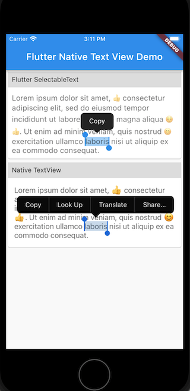

# Native Text View for Flutter

A text view widget built using the native `UITextView` on iOS (this package only supports iOS for now). For text input, please refer to [flutter-native-text-input](https://github.com/henryleunghk/flutter-native-text-input).

## Installation

Follow the instructions from https://pub.dev/packages/flutter_native_text_view/install

## Why you should use this

Mobile app users are used to the convenience features for text selection provided by the native system. Even though Flutter provides a lot of useful widgets, Flutter developers may notice that `SelectableText` provided by Flutter are not on par with their native counterpart. Some actions are missing.

Hope you find it useful and happy coding! 🎉🎉🎉

## Plugin API

| Name            | Type          | Description                    | Default                  |
|:----------------|:--------------|:-------------------------------|:-------------------------|
| `decoration`      | BoxDecoration          | Controls the BoxDecoration of the box behind the text input. (https://api.flutter.dev/flutter/cupertino/CupertinoTextField/decoration.html) | null |
| `style`           | TextStyle              | The style to use for the text being edited [Only `fontSize`, `fontWeight`, `color` are supported] (https://api.flutter.dev/flutter/material/TextField/style.html) | null |
| `textAlign`       | TextAlign              | How the text should be aligned horizontally (https://api.flutter.dev/flutter/material/TextField/textAlign.html) | TextAlign.start |
| `minLines`        | int                    | Minimum number of lines of text view widget | 1 |
| `maxLines`        | int                    | Maximum number of lines of text view body, 0 for no limit | 0 |

## Contributing

### Found a bug?
Please do not hestitate to report that. This cuuld help improve this package.

### Feature request?
Please feel free to create an issue.

### Pull request?
Contributors are welcome. Just create a PR and it would be reviewed and merged ASAP.

If you enjoy using this package or it helps you or your team, you could also buy me a cup of coffee to show support :)

https://PayPal.Me/hkhenryleung

## License

This project is licensed under the [MIT License](https://opensource.org/licenses/mit-license.html).
